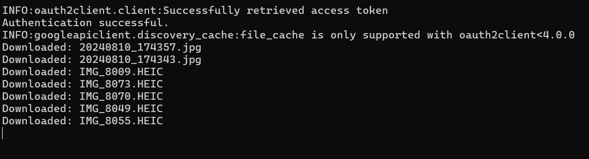
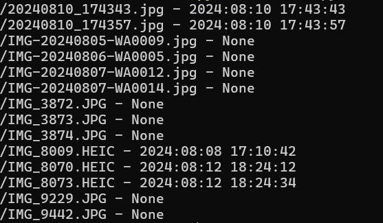

# Foto_drives

## Description

This program is a simple file manager that allows you to download images from a drive folder and order them by date.

### Note

Some images might not have the date in the metadata, so they will stay in the base folder.

## Improvements

- [ ] Read the date from the name of the file, if the metadata is not available.

## Requirements

You need the client_secrets.json file from the Google API Console. You can download it from the [Google API Console](https://console.developers.google.com/) after creating a new project and enabling the Google Drive API.

python >= 3.9

To run the project, you need to have Python installed on your machine. You can download Python from the [official website](https://www.python.org/downloads/)

**Setting Up the Environment**

* Windows: `./setup_Windows.bat`
* Linux/macOS: `./setup_Linux.sh`

These scripts will install required dependencies, and build a virtual environment for you if you don't have one.

## Usage

Run the following command to start the application:

```bash
cd bin
python ./main.py
```

Here is how the will look like:


And here is how the images will be ordered:


None is because the image doesn't have the date in the metadata.

## License

This project is licensed under the MIT License - see the [LICENSE](LICENSE) file for details.

## Author

[Neetre](https://github.com/Neetre)
